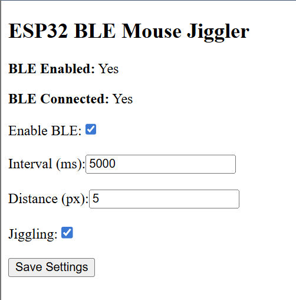

# ESP32 BLE Mouse Jiggler with Web UI Control

This project turns your ESP32 into a **Bluetooth LE mouse jiggler** that periodically moves the mouse pointer or scrolls slightly to prevent system sleep. A built-in Wi-Fi access point and web interface allow you to control the jiggler behavior in real time — no PC software required!

---

## 🚀 Features

- ✅ Emulates BLE HID mouse movement
- ✅ Configurable jiggle interval (in ms)
- ✅ Adjustable pixel distance
- ✅ Toggle jiggling on/off
- ✅ Enable or disable the BLE stack at runtime
- ✅ Shows BLE connection status
- ✅ Built-in Wi-Fi access point and web server
- ✅ Settings persist across power cycles

---

## 📦 Hardware Requirements

- ESP32 Dev Module or M5Stack Core
- (Optional) OLED display or buttons if expanding functionality

---

## 🧰 Software Dependencies

Install these libraries via Arduino IDE or `lib_deps` if using PlatformIO:

- `ESP32 BLE Mouse` by T-vK (manual install from GitHub: [ESP32-BLE-Mouse](https://github.com/T-vK/ESP32-BLE-Mouse))
- `WiFi.h` *(built into ESP32 core)*
- `WebServer.h` *(built into ESP32 core)*
- `Preferences.h` *(built into ESP32 core)*
- `NimBLEDevice.h` *(automatically available if using ESP32 Arduino Core ≥ 2.0)*

---

## ⚙️ Board Configuration

| Setting | Value |
|--------|--------|
| Board | ESP32 Dev Module or M5Stack-Core-ESP32 |
| Partition Scheme | Huge APP (3MB No OTA) |
| Flash Size | 4MB (common) |
| Upload Speed | 921600 baud recommended |

---

## 🔌 Setup Instructions

1. Clone or download this repository into your `Arduino` folder.
2. Open `ESP32_MouseJiggler.ino` in the Arduino IDE.
3. Ensure the correct board and partition scheme are selected.
4. Upload to your ESP32.
5. Connect to the Wi-Fi Access Point:  
   - **SSID:** `ESP32-Jiggler`  
   - **Password:** `jiggle123`
6. Open a browser and go to: [http://192.168.4.1](http://192.168.4.1)

---

## 🌐 Web Interface

Use the web interface to:

- Toggle BLE on/off
- Enable or disable jiggling
- Set the jiggle interval (ms)
- Set the distance in pixels
- View BLE connection status

> All settings are saved to flash and persist after reboot.

---

## 🛠️ Example Screenshot

